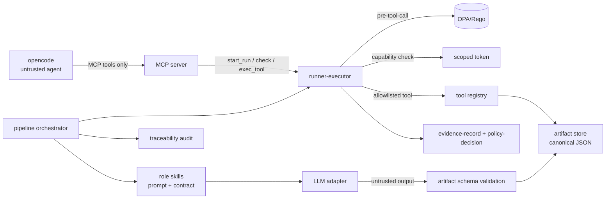

# M6 — Agent execution layer (план)

Статус: **запланирован** (не начат). Не входит в MVP (M0–M5). Основание — ADR-0011, который
фиксирует необходимые слои (`runner` + scoped token, MCP-медиация, `.opencode/` profiles), но эти
компоненты до сих пор не реализованы. Этот документ — план слоя «агент, который проходит
идея → фича под управлением платформы».

## Зачем

Сейчас платформа умеет **проверять и фиксировать** (схемы, OPA-точки, evidence, waiver,
traceability), но не **исполнять** агентский конвейер. Артефакты `idea → specification →
threat-model → plan → task → review` существуют как канонические JSON и примеры, однако их
сейчас пишет человек/агент вручную (как в этой сессии). Нет:

1. **runner-executor** — фактического исполнителя разрешённых tool-вызовов в песочнице;
2. **role skills** — промпт + контракт выхода для каждой роли;
3. **MCP-моста** — единственной двери `opencode → платформа → OPA`;
4. **оркестратора** — прохода `idea → … → review` с policy/evidence/артефактами на каждом шаге.

Без этих четырёх частей «агент + платформа» не проходят контур автоматически.

## Scope

- **In scope:** runner-executor и allowlisted tool-registry; скилы ролей с контрактами артефактов;
  LLM-adapter (с детерминированным stub для тестов); MCP-сервер; конфигурация `.opencode/`;
  pipeline-оркестратор для одного вертикального среза golden path; evidence/policy/traceability на
  каждом шаге.
- **Out of scope:** production deployment, реальные внешние модели как обязательная зависимость,
  multi-domain, web UI, K8s, автономный incident triage (см. `docs/roadmap.md`).

## Архитектура слоя

Ключевые инварианты (без изменений относительно ADR-0011):
- Instructions in-band не контроль; LLM-output — untrusted, только данные.
- Sensitive никогда не попадает в model context (trust pipeline).
- Нет произвольного shell: только allowlisted инструменты с scope.
- Агент не может утверждать артефакты/релизы; approvals — только human.
- Каждый шаг порождает `policy-decision` и `evidence-record`; цепочка трассируемости полная.

## Компоненты и интерфейсы

| Компонент | Пакет (предлагается) | Ответственность |
|---|---|---|
| Tool registry | `control-plane/src/sdlc/tools/` | allowlist инструментов (`read_artifact`, `write_artifact`, `run_tests`, `open_pr`, …), у каждого scope и JSON-схема args/result |
| Runner executor | `control-plane/src/sdlc/runner/executor.py` | после OPA allow + capability check исполнить инструмент; записать evidence; fail-closed |
| LLM adapter | `control-plane/src/sdlc/llm/` | единый интерфейс вызова модели; stub для тестов; sensitive не в контексте |
| Role skills | `control-plane/src/sdlc/skills/<role>/` | промпт (trusted config) + входной контекст + выходной контракт артефакта |
| MCP server | `control-plane/src/sdlc/mcp/` | экспозиция tools по MCP; аутентификация capability-токеном; единственная дверь |
| Pipeline orchestrator | `control-plane/src/sdlc/pipeline/` | стадии `idea→spec→threat→plan→task→implement→review`, policy+evidence+validate |
| OpenCode integration | `.opencode/` (protected) | MCP-регистрация, `permission`, plugin `tool.execute.before`/`permission.ask` → OPA, role profiles |

Роли (из `actorRole`): `grill` → specification, `grill-security` → threat-model, `planner` → plan,
`task-writer` → task, `implementer` → code changes (через PR), `reviewer` → review.

## Задачи (FEAT-0006)

Порядок — вертикальными срезами, рисками вперёд; каждый = contract → code → test.

- [ ] **TASK-0000 — ADR-0014 + roadmap.** Формализовать новый milestone: ADR-0014 «Agent execution
  layer» и перенос пункта в `docs/roadmap.md` (защищённые зоны, требуют CODEOWNERS-ревью).
- [ ] **TASK-0001 — tool registry + runner-executor.** Allowlisted инструменты с scope/схемами;
  исполнение после OPA `pre-tool-call` + capability; `evidence-record` на вызов; fail-closed.
  Тесты: deny без policy, deny без capability, allow и запись evidence, неизвестный инструмент.
- [ ] **TASK-0002 — LLM adapter + skill `task-writer`.** Один вертикальный срез: по approved
  specification+plan получить canonical `task`, провалидировать по схеме, зафиксировать
  policy-decision/evidence. Stub-LLM для детерминированных тестов; negative — LLM-output как
  instruction игнорируется, sensitive не в контексте.
- [ ] **TASK-0003 — остальные role skills.** `grill`→specification, `grill-security`→threat-model,
  `planner`→plan, `reviewer`→review. Каждый с контрактом артефакта и тестами на stub-LLM.
- [ ] **TASK-0004 — MCP server.** Экспозиция tools по MCP; capability-аутентификация; in-process
  клиентские тесты (policy-gated вызовы, ошибки fail-closed).
- [ ] **TASK-0005 — `.opencode/` интеграция.** MCP-регистрация, урезанный `permission`, plugin
  `tool.execute.before`/`permission.ask` → OPA, role profiles. Защищённая зона — ревью CODEOWNERS.
- [ ] **TASK-0006 — pipeline orchestrator (e2e).** Проход `idea→…→review` для одного среза на
  stub-агенте; на каждом шаге policy+evidence; финальный `sdlc trace` — COMPLETE. Обновить
  `docs/sequences.md`, README, PROGRESS.

## Критерии приёмки M6

1. Внешний агент (`opencode`) с `.opencode/` может **только через MCP** провести срез
   `idea → task` (минимум) для golden path, с policy-гейтом на каждом вызове.
2. Все порождённые артефакты проходят JSON Schema; `sdlc trace --feature …` → COMPLETE.
3. Каждый tool-вызов имеет `evidence-record`; каждый policy-гейт — `policy-decision`.
4. Sensitive не попадает в model context; агент не может утверждать артефакты/релизы.
5. Неизвестный инструмент / отсутствие capability / недоступная policy — fail-closed.

## Риски и ограничения

- **Sandbox.** Начальный executor — in-process (слабже изоляции контейнера); реальная песочница
  с ограничением syscalls/egress — отдельный шаг. Явно фиксировать в `docs/limitations.md`.
- **Модель как зависимость.** Реальный провайдер требует креденшелов — нельзя нарушать «нет
  долгоживущих секретов»; вариант — локальная модель или scoped ephemeral credential.
- **Границы скилов.** Промпт-шаблоны — trusted config, но их выход — untrusted; разделение должно
  быть явным и покрыто тестами (ADR-0007, ADR-0011).
- **Governance.** `.opencode/`, `policies/`, `docs/roadmap.md`, `docs/adr/` — защищённые зоны;
  TASK-0000 и TASK-0005 требуют CODEOWNERS-ревью.

## Ссылки

ADR-0004, ADR-0007, ADR-0011; `docs/roadmap.md`; `docs/evidence-model.md`;
`control-plane/src/sdlc/{policy,runner,evidence,trust}`.