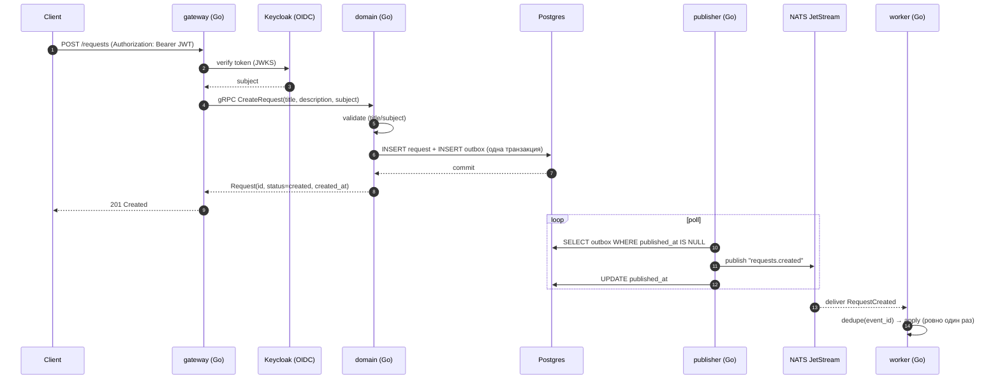
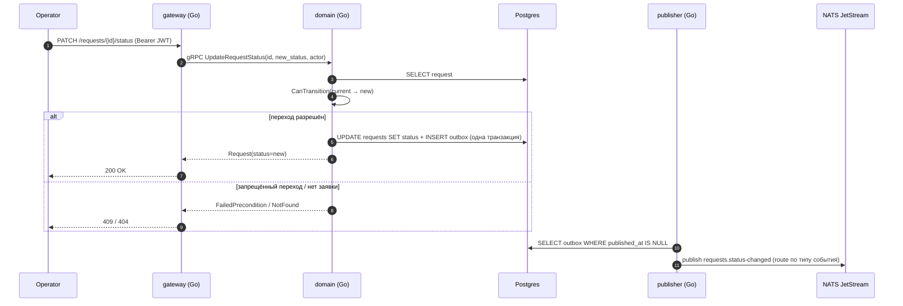
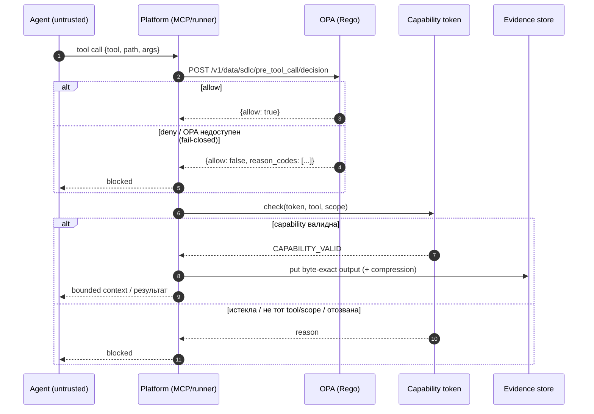
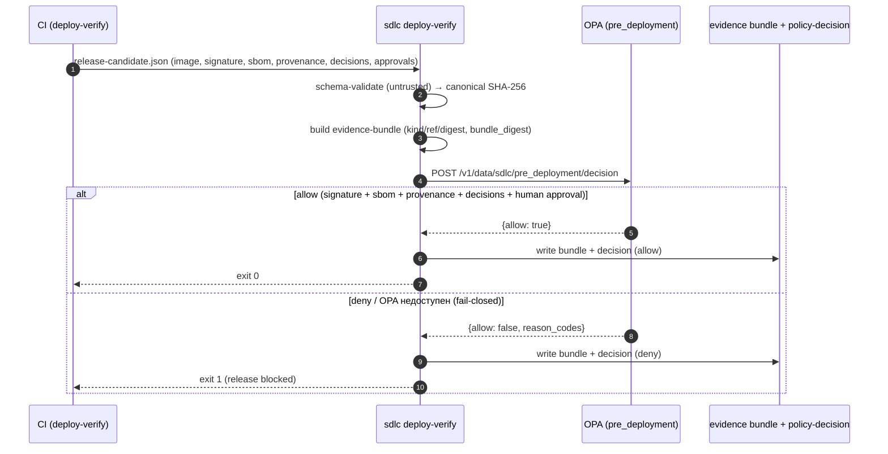
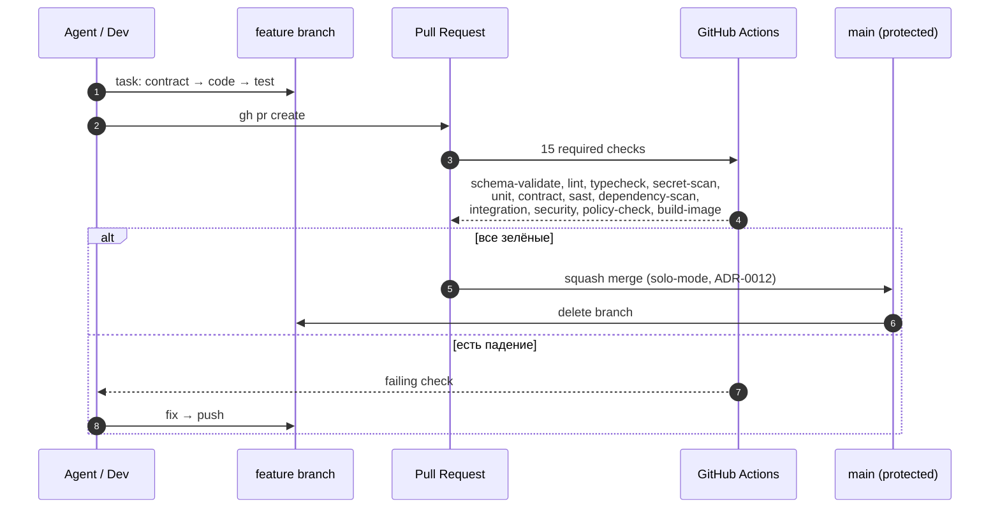
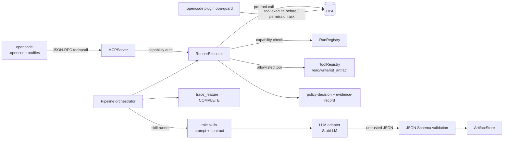

# Последовательности (sequence diagrams)

Наглядные схемы того, как устроена платформа и как ведётся работа. **Обновляется по мере
прогресса** — при изменении потока правь соответствующую диаграмму и раздел «Прогресс».

Статус milestone: **M0 ✅ · M1 ✅ · M2 ✅ · M3 ✅ · M4 ✅ · M5 ✅ · M6 ✅**

Источники: `README.md` (модель исполнения/контроля), `docs/adr/`, `PROGRESS.md`.

---

## 1. Golden path (runtime)

Аутентифицированный пользователь создаёт заявку; событие доставляется воркеру.



Реализация: `apps/gateway`, `apps/domain`, `apps/publisher`, `apps/worker`,
контракты — `contracts/{openapi,proto,events}`. Тесты e2e: `apps/worker/.../e2e_smoke_integration_test.go`.

---

## 2. Lifecycle заявки (M2)

State machine `created → triaged → in_progress → resolved → closed` (+ `cancelled` из первых трёх).
Изменить статус можно только по разрешённому переходу; изменение статуса и событие пишутся одной
транзакцией (transactional outbox). Operator workflow (list/get/update) — REST в gateway (TASK-0002).



Оператор также читает заявки: `GET /requests` (фильтры `status`/`subject`/`limit`) и
`GET /requests/{id}` → gRPC `ListRequests` / `GetRequest`. Авторизация (SPEC-0001/TM-0001):
gateway извлекает роль из OIDC-claim (`operator`/`user`) и передаёт verified context; domain
ограничивает не-operator только своими заявками (чужой id → 404), менять статус может только
operator (иначе 403/PermissionDenied).

Реализация: `apps/domain/internal/domain/{service,memory,postgres}.go` (`CanTransition`, `ListFilter`),
`apps/gateway/server.go` (REST → gRPC, маппинг кодов), `apps/publisher/internal/outbox/poller.go`
(маршрутизация `eventSubjects`), событие — `contracts/events/request-status-changed.schema.json`.
Тесты: `apps/domain/internal/domain/{lifecycle,query}_test.go`, `apps/gateway/server_test.go`,
`poller_test.go`, `test_contracts.py`. Полный operator-flow e2e (create → 4 перехода → read-back,
outbox: 1 created + 4 status-changed) — `postgres_integration_test.go`; async-часть —
`worker/.../e2e_smoke_integration_test.go`.

---

## 3. Enforcement вокруг агента (untrusted)

Каждый tool-call проходит policy (OPA) и scoped capability; sensitive не попадает в контекст.



Реализация: `policies/{pre_tool_call,artifact_transition,pre_deployment}.rego`,
`control-plane/src/sdlc/{policy,runner,evidence,trust,waiver}`.
Тесты: `control-plane/tests/test_{policy,runner,evidence,negative_pipeline,waiver,artifact_transition,pre_deployment,deploy_verify}.py`,
`policies/tests/` (opa test). Из четырёх точек ADR-0004 реализованы `pre-tool-call`,
`artifact-transition`, `pre-deployment`; `pr-ci` — остаётся.

---

## 4. Независимый release gate (M3)

Релиз-кандидат проверяется отдельно от build job: evidence собирается в контент-адресуемый
bundle, решение принимает `pre-deployment` policy (fail-closed), результат фиксируется как
`policy-decision`. Agent-approval не считается; нужен human `release-approver`.



Реализация: `control-plane/src/sdlc/deploy_verify/` (`candidate`, `bundle`, `verify`),
`policies/pre_deployment.rego`, CLI `sdlc deploy-verify`. CI: стадия `policy-check` прогоняет
self-test на реальной политике. Контракты: `contracts/schemas/{release-candidate,evidence-bundle}.schema.json`.

---

## 5. Разработка и CI (как агент меняет репозиторий)



---

## 6. Observability pipeline (M4)

Сервисы инструментированы OpenTelemetry (traces/metrics/logs) и экспортируют OTLP в Collector,
который **обязательно** redacts secrets/tokens/PII перед выгрузкой (ADR-0010). Метрики идут в
Prometheus (метка `service_name`), трейсы — в Tempo, логи — в Loki; SLO golden path под алертами.

```mermaid
sequenceDiagram
    autonumber
    participant G as gateway (Go, otelhttp/otelgrpc)
    participant D as domain (Go, otelgrpc)
    participant C as OTel Collector
    participant P as Prometheus
    participant T as Tempo
    participant L as Loki

    G->>D: gRPC (traceparent injected, тот же trace)
    D-->>G: response
    G->>C: OTLP spans/metrics/logs
    D->>C: OTLP spans/metrics/logs
    C->>C: transform/redact: authorization/cookie → [REDACTED];<br/>password|secret|token|api_key → [REDACTED];<br/>email → [REDACTED_EMAIL]
    C->>T: traces
    C->>P: metrics (resource attrs → service_name)
    C->>L: logs
    P->>P: alert rules (GoldenPath{ServiceDown,HighErrorRate,HighLatency})
```

Реализация: `apps/internal/telemetry` (`Setup`, `HTTPHandler`, `GRPCServerOption`),
`infra/compose/otel-collector.yaml` (redaction), `prometheus.yml` + `prometheus/rules/golden-path.yml`,
`grafana/provisioning/{datasources,dashboards}`. Staging — `infra/staging/`.
Guard/тесты: `control-plane/tests/test_{redaction,observability,alerts,staging}.py`,
`apps/internal/telemetry/telemetry_test.go` (в т.ч. `TestGoldenPathObservabilitySmoke`).

---

## 7. Agent execution layer (M6)

Платформа не только проверяет, но и **исполняет** конвейер (ADR-0014). Внешний агент `opencode`
физически ограничен `.opencode/` (нет прямого shell/ФС/сети) и работает только через MCP-мост;
каждый вызов проходит OPA `pre-tool-call` + scoped capability, каждый шаг порождает
`policy-decision`/`evidence-record`.



Роли: `grill`→specification, `grill-security`→threat-model, `planner`→plan, `task-writer`→task,
`reviewer`→review; `security-review` компилируется платформой детерминированно из threat-model.
Sensitive не попадает в model context; LLM-output — untrusted data, инъекции полей игнорируются.

Реализация: `control-plane/src/sdlc/{tools,runner/executor,llm,skills,mcp,pipeline}`,
`.opencode/` (`opencode.json`, `plugin/opa-guard.ts`, `agent/*.md`). Guard/тесты:
`control-plane/tests/test_{tools,executor,skills,mcp,pipeline,opencode_config}.py`.

---

## 8. Прогресс по milestone

| Milestone | Статус | Диаграмма |
|---|---|---|
| M0 Фундамент | ✅ | — |
| M1 Walking skeleton | ✅ | §1, §3, §5 |
| M2 Домен и lifecycle | ✅ | §2 |
| M3 Supply chain hardening | ✅ | §3 (pre-deployment), §4 |
| M4 Staging + observability | ✅ | §6 |
| M5 Portfolio | ✅ | `docs/security-demos.md`, `sdlc trace` |
| M6 Agent execution layer | ✅ | §7 |

### Как обновлять
1. Меняя поток — правь соответствующую Mermaid-диаграмму.
2. Меняя статус этапа — обновляй строку в таблице и строку «Статус milestone» сверху.
3. Держи `PROGRESS.md` и `README.md` согласованными с этим файлом.