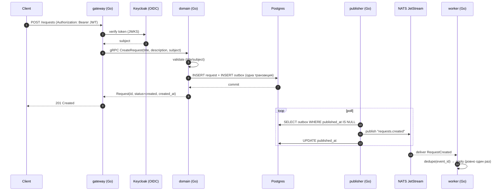
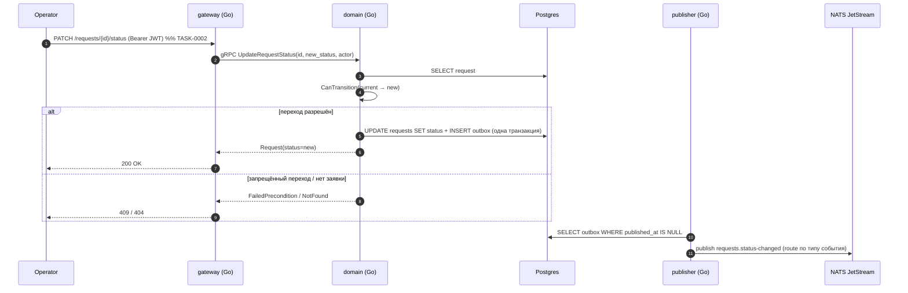
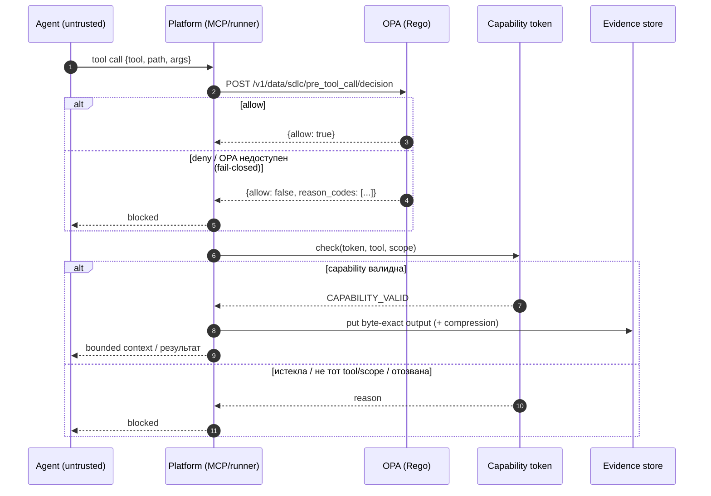
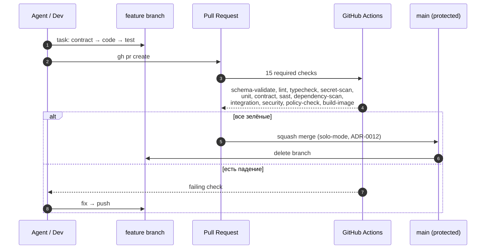

# Последовательности (sequence diagrams)

Наглядные схемы того, как устроена платформа и как ведётся работа. **Обновляется по мере
прогресса** — при изменении потока правь соответствующую диаграмму и раздел «Прогресс».

Статус milestone: **M0 ✅ · M1 ✅ · M2 ⏳ · M3 · M4 · M5**

Источники: `README.md` (модель исполнения/контроля), `docs/adr/`, `PROGRESS.md`.

---

## 1. Golden path (runtime)

Аутентифицированный пользователь создаёт заявку; событие доставляется воркеру.

Реализация: `apps/gateway`, `apps/domain`, `apps/publisher`, `apps/worker`,
контракты — `contracts/{openapi,proto,events}`. Тесты e2e: `apps/worker/.../e2e_smoke_integration_test.go`.

---

## 2. Lifecycle заявки (M2)

State machine `created → triaged → in_progress → resolved → closed` (+ `cancelled` из первых трёх).
Изменить статус можно только по разрешённому переходу; изменение статуса и событие пишутся одной
транзакцией (transactional outbox). REST-часть (`PATCH /requests/{id}/status`) — TASK-0002.

Реализация: `apps/domain/internal/domain/{service,memory,postgres}.go` (`CanTransition`),
`apps/publisher/internal/outbox/poller.go` (маршрутизация `eventSubjects`), событие —
`contracts/events/request-status-changed.schema.json`.
Тесты: `apps/domain/internal/domain/lifecycle_test.go`, `poller_test.go`, `test_contracts.py`.

---

## 3. Enforcement вокруг агента (untrusted)

Каждый tool-call проходит policy (OPA) и scoped capability; sensitive не попадает в контекст.

Реализация: `policies/pre_tool_call.rego`, `control-plane/src/sdlc/{policy,runner,evidence,trust}`.
Тесты: `control-plane/tests/test_{policy,runner,evidence,negative_pipeline}.py`.

---

## 4. Разработка и CI (как агент меняет репозиторий)

---

## 5. Прогресс по milestone

| Milestone | Статус | Диаграмма |
|---|---|---|
| M0 Фундамент | ✅ | — |
| M1 Walking skeleton | ✅ | §1, §3, §4 |
| M2 Домен и lifecycle | ⏳ | §2 |
| M3 Supply chain hardening | — | (container-scan / sbom / sign) |
| M4 Staging + observability | — | (otel pipeline) |
| M5 Portfolio | — | (traceability, blocked attacks) |

### Как обновлять
1. Меняя поток — правь соответствующую Mermaid-диаграмму.
2. Меняя статус этапа — обновляй строку в таблице и строку «Статус milestone» сверху.
3. Держи `PROGRESS.md` и `README.md` согласованными с этим файлом.